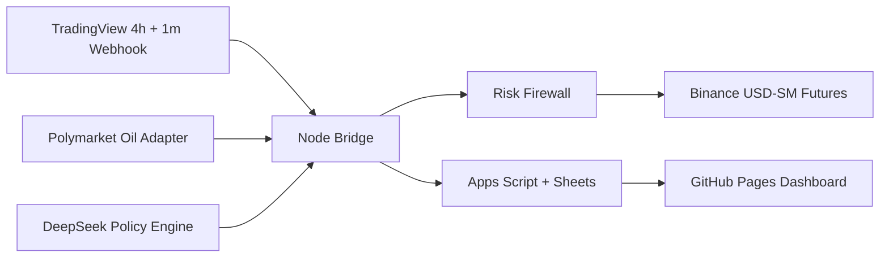

# DOGE Hybrid Operating Spec

Especificacao operacional para um bot de `DOGEUSDT` em `Binance USD-SM Futures` com:

- contexto direcional de `TradingView` em `4h`
- execucao em `1m`
- leitura de mercado macro via `Polymarket` para bets de petroleo
- camada tatico-preditiva via `DeepSeek API`
- firewall de risco e execucao deterministica no bridge Node.js

## 1. Objetivo

O objetivo nao e transformar o modelo em trader autonomo irrestrito.

O objetivo e construir um sistema em que:

- `TradingView 4h` decide contexto direcional e regime
- `Polymarket oil` decide stress macro
- `DeepSeek` decide politica tatico-operacional
- `Binance engine` decide execucao final sob regras duras

Em resumo:

- modelo decide `permissao`
- engine decide `ordem`

## 2. Nao objetivos

Este modo hibrido nao deve:

- deixar o modelo enviar ordens diretamente
- deixar o modelo definir tamanho sem limite
- deixar o modelo operar sem filtros de latencia, saldo e risco
- usar `Polymarket oil` como gatilho causal direto de compra ou venda em DOGE

`Polymarket oil` entra como proxy de `stress macro`, nao como driver primario de direcao para um memecoin.

## 3. Referencia macro atual

Em `3 de abril de 2026`, a referencia principal para petroleo na Polymarket era o evento:

- [WTI April 2026](https://polymarket.com/event/what-price-will-wti-hit-in-april-2026)

Esse mercado estava ativo, com volume por volta de `US$ 4.8M`, e a propria pagina informa resolucao por candles de `1 minuto` do WTI via `Pyth`, com fallback para `CME` em caso de falha tecnica.

Na arquitetura, esse evento deve ser tratado como:

- `market family = oil stress ladder`
- `source of macro risk sentiment`
- `not a direct DOGE predictor`

## 4. Fontes oficiais do sistema

### TradingView

- webhooks: [How to configure webhook alerts](https://www.tradingview.com/support/solutions/43000529348-how-to-configure-webhook-alerts/)
- strategy alerts: [Strategy Alerts](https://www.tradingview.com/support/solutions/43000481368-strategy-alerts/)

Uso operacional importante:

- TradingView envia `HTTP POST` com o body do alerta
- se o body for JSON valido, ele usa `application/json`
- apenas portas `80` e `443` sao aceitas
- se o servidor demorar mais de `3 segundos`, o request pode ser cancelado
- alertas de estrategia podem ser interrompidos se dispararem mais de `15 vezes em 3 minutos`

### Binance Futures

- nova ordem: [New Order](https://developers.binance.com/docs/derivatives/usds-margined-futures/trade/rest-api/New-Order)
- modo de posicao: [Change Position Mode](https://developers.binance.com/docs/derivatives/usds-margined-futures/trade/rest-api/Change-Position-Mode)
- tipo de margem: [Change Margin Type](https://developers.binance.com/docs/derivatives/usds-margined-futures/trade/rest-api/Change-Margin-Type)
- leverage: [Change Initial Leverage](https://developers.binance.com/docs/derivatives/usds-margined-futures/trade/rest-api/Change-Initial-Leverage)

Uso operacional importante:

- `positionSide = BOTH` em `One-way`
- `reduceOnly` disponivel para fechar em `One-way`
- `ISOLATED` e configurado por simbolo
- leverage e configurado por simbolo

### Polymarket

- introducao e familias de API: [Polymarket API Introduction](https://docs.polymarket.com/api-reference/introduction)
- rate limits: [Polymarket Rate Limits](https://docs.polymarket.com/api-reference/rate-limits)
- market by id: [Get market by id](https://docs.polymarket.com/api-reference/markets/get-market-by-id)
- market by slug: [Get market by slug](https://docs.polymarket.com/api-reference/markets/get-market-by-slug)
- midpoint: [Get midpoint price](https://docs.polymarket.com/api-reference/data/get-midpoint-price)
- price history: [Get prices history](https://docs.polymarket.com/developers/CLOB/timeseries)
- orderbook: [Orderbook](https://docs.polymarket.com/trading/orderbook)

Uso operacional importante:

- `Gamma API` e publica para descoberta de mercados
- `Data API` e publica para dados agregados
- `CLOB` publica ordem, midpoint, spreads e price history
- limites sao altos o suficiente para polling moderado, mas o bot nao deve abusar da frequencia

### DeepSeek

- modelos e preco: [Models & Pricing](https://api-docs.deepseek.com/quick_start/pricing/)
- function calling: [Function Calling](https://api-docs.deepseek.com/guides/function_calling)

Uso operacional importante:

- `deepseek-chat` e `deepseek-reasoner` suportam `JSON Output` e `Tool Calls`
- `strict` mode existe para aderencia a schema
- o modelo nao executa ferramentas sozinho; o cliente precisa executar e devolver os resultados

## 5. Arquitetura alvo



## 6. Componentes e responsabilidade

### 6.1 TradingView Signal Layer

Responsavel por gerar:

- `bias_4h`
- `trend_strength_4h`
- `volatility_regime_4h`
- `timing_setup_1m`

Saidas permitidas:

- `LONG_ENTRY`
- `SHORT_ENTRY`
- `FLAT_EXIT`
- `NO_ACTION`

O Pine nao decide leverage final nem tamanho final.

### 6.2 Polymarket Oil Adapter

Responsavel por:

- descobrir o mercado/evento de petroleo ativo via `Gamma`
- resolver os `token_id` relevantes
- ler `midpoint`, `price`, `spread` e `prices-history` via `CLOB`
- consolidar um snapshot macro

Entradas principais:

- evento `WTI April 2026`
- possivelmente `Brent` em fase futura
- ladder de alvos como `120`, `130`, `140`, `150`

Saida normalizada:

```json
{
  "event_slug": "what-price-will-wti-hit-in-april-2026",
  "timestamp": "2026-04-03T19:00:00Z",
  "oil_markets": [
    {
      "label": "WTI>=120",
      "midpoint": 0.74,
      "spread": 0.02,
      "price_change_15m": 0.03,
      "price_change_1h": 0.08,
      "liquidity_state": "normal"
    }
  ],
  "macro_stress_score": 0.71,
  "macro_regime": "RISK_OFF"
}
```

### 6.3 DeepSeek Policy Engine

Responsavel por transformar contexto em politica tatico-operacional.

Entradas:

- snapshot de `TradingView`
- snapshot de `Binance`
- snapshot de `Polymarket`
- estado de posicao e risco
- historico curto de ultimos trades

Saida obrigatoria em JSON estrito:

```json
{
  "decision_id": "uuid",
  "risk_mode": "normal",
  "allowed_side": "LONG_ONLY",
  "allow_new_position": true,
  "leverage_cap": 4,
  "size_multiplier": 0.8,
  "stop_profile": "tight",
  "take_profit_profile": "scalp",
  "hold_policy": "scalp_only",
  "confidence": 0.67,
  "ttl_seconds": 300,
  "rationale_short": "4h bullish, oil stress rising, prefer reduced-risk long-only"
}
```

### 6.4 Risk Firewall

E a camada mais importante do sistema.

Ele:

- valida se a saida do modelo respeita limites
- converte politica em acao permitida
- pode ignorar o modelo e bloquear operacao

Regras fixas:

- nao permitir ordem se o modelo falhar
- nao permitir leverage acima do cap global
- nao permitir flip continuo em bar curto
- nao permitir novos trades acima do limite diario
- nao permitir media contra perda
- nao permitir ordem se `Polymarket` estiver stale
- nao permitir ordem se `TradingView` e `DeepSeek` estiverem em conflito severo

### 6.5 Binance Execution Engine

Responsavel por:

- manter `One-way Mode`
- manter `ISOLATED`
- aplicar leverage final
- enviar `MARKET` ou `LIMIT` conforme perfil
- usar `reduceOnly` nos fechamentos
- reconciliar order e fill real

### 6.6 Observabilidade

Responsavel por:

- armazenar sinais recebidos
- armazenar decisoes do modelo
- armazenar ordens e fills
- armazenar equity e drawdown
- publicar snapshots para `Apps Script` e `GitHub Pages`

## 7. Modos operacionais

### 7.1 Modo teste

Objetivo:

- replay historico
- validar regras
- medir PnL
- gerar dataset supervisionado e analitico

Entradas:

- candles Binance Futures
- estados historicos reconstruidos da estrategia
- snapshots historicos simplificados de macro

Saidas:

- `backtest-report.json`
- `backtest-trades.json`
- `backtest-equity.json`
- `training-samples.jsonl`

### 7.2 Modo trading real

Objetivo:

- receber sinais em tempo real
- aplicar politica do modelo
- operar com dinheiro real

Entradas:

- webhook `1m`
- contexto `4h`
- snapshot Polymarket atualizado
- decisao JSON do DeepSeek
- saldo/posicao Binance

Saidas:

- ordem real
- log de fill
- update para Apps Script

## 8. Cadencia de cada camada

### TradingView 4h

- recalculo em fechamento de candle `4h`
- atualiza `bias_4h`, `trend_strength_4h`, `htf regime`

### TradingView 1m

- gera timing e gatilho
- apenas envia webhook quando setup dispara

### Polymarket adapter

Recomendacao:

- refresh a cada `60s`
- refresh imediato antes de abrir nova posicao

### DeepSeek policy

Recomendacao:

- `deepseek-reasoner`: a cada `15m` ou em mudanca de regime
- `deepseek-chat`: a cada `1m a 5m` ou on-demand antes de entrada

O modelo nao deve ser chamado em cada microevento do livro de ordens.

## 9. Entradas do modelo

### 9.1 TradingView features

- `bias_4h`
- `trend_strength_4h`
- `ema_stack_4h`
- `atr_regime_4h`
- `setup_direction_1m`
- `setup_reason_1m`
- `rsi_1m`
- `atr_pct_1m`

### 9.2 Binance features

- `wallet_balance`
- `available_balance`
- `current_position_side`
- `current_position_qty`
- `entry_price`
- `unrealized_pnl`
- `effective_leverage`
- `spread_estimate`
- `recent_trade_latency_ms`

### 9.3 Polymarket features

- `oil_macro_stress_score`
- `wti120_midpoint`
- `wti130_midpoint`
- `wti140_midpoint`
- `wti120_delta_15m`
- `wti130_delta_1h`
- `oil_market_liquidity_state`

### 9.4 Risk features

- `daily_pnl`
- `drawdown_today`
- `consecutive_losses`
- `trades_today`
- `last_model_confidence`

## 10. Saida do modelo e contrato obrigatorio

O modelo so pode devolver estes campos:

```json
{
  "risk_mode": "risk_on | normal | risk_off | no_trade",
  "allowed_side": "LONG_ONLY | SHORT_ONLY | BOTH | NONE",
  "allow_new_position": true,
  "leverage_cap": 1,
  "size_multiplier": 0.5,
  "stop_profile": "tight | normal | wide",
  "take_profit_profile": "scalp | standard | extended",
  "hold_policy": "scalp_only | allow_hold | fast_exit",
  "confidence": 0.0,
  "ttl_seconds": 300,
  "rationale_short": "string"
}
```

Campos proibidos ao modelo:

- preco de ordem final
- order id
- credenciais
- bypass de risco
- comando bruto de execucao

## 11. Matriz de decisao

### Caso 1

- `TV 4h = BULL`
- `setup 1m = LONG_ENTRY`
- `oil macro = RISK_ON`
- `DeepSeek = LONG_ONLY`

Resultado:

- pode abrir `LONG`
- leverage limitada ao menor cap entre config e modelo

### Caso 2

- `TV 4h = BULL`
- `setup 1m = LONG_ENTRY`
- `oil macro = RISK_OFF`
- `DeepSeek = LONG_ONLY`, `risk_mode = risk_off`

Resultado:

- pode abrir `LONG` reduzido
- leverage menor
- stop mais curto
- `hold_policy = scalp_only`

### Caso 3

- `TV 4h = BULL`
- `setup 1m = SHORT_ENTRY`

Resultado:

- bloquear entrada por conflito de contexto

### Caso 4

- `Polymarket` stale
- `DeepSeek` indisponivel

Resultado:

- `NO NEW POSITION`
- apenas gestao de saida e protecao de risco

## 12. Politica de leverage

Leverage final:

```text
effective_leverage = min(
  config_leverage_cap,
  model_leverage_cap,
  risk_firewall_cap,
  symbol_leverage_cap
)
```

Recomendacao inicial:

- cap global: `5x`
- hard max estrutural: `10x`
- se `macro_stress_score > 0.70`, reduzir para `1x a 3x`
- se drawdown diario estiver perto do limite, forcar `1x` ou `NO TRADE`

## 13. Politica de entrada e saida

### Entrada

Permitir entrada somente se:

- sinal `1m` estiver alinhado com `4h`
- `allowed_side` do modelo permitir
- risco diario permitir
- `Polymarket snapshot age <= 90s`
- decisao DeepSeek ainda estiver dentro do `ttl_seconds`

### Gestao

Depois da entrada:

- break-even automatico apos lucro minimo
- trailing stop por ATR
- modelo pode ajustar `profile`, mas nao pode remover o stop minimo

### Saida

Saida obrigatoria quando:

- stop tecnico aciona
- `FLAT_EXIT` do Pine com alinhamento
- modelo entra em `no_trade` e a posicao perde suporte contextual
- risco diario entra em modo stop

## 14. Safe mode

O sistema deve entrar em `safe mode` se qualquer uma destas falhas ocorrer:

- TradingView sem sinal valido
- Apps Script indisponivel
- DeepSeek timeout
- Polymarket timeout ou dado stale
- Binance latency anormal
- rejeicao de ordem pela Binance

No `safe mode`:

- nao abre nova posicao
- apenas fecha ou protege posicao aberta
- registra incidente

## 15. Ferramentas expostas ao DeepSeek

Use `function calling` com `strict` mode.

Ferramentas recomendadas:

- `get_tradingview_state()`
- `get_polymarket_oil_snapshot()`
- `get_binance_account_state()`
- `get_recent_execution_stats()`
- `get_open_position_state()`

O fluxo correto e:

1. cliente coleta dados
2. cliente entrega dados ao modelo
3. modelo devolve politica JSON
4. firewall valida
5. executor decide

O modelo nunca fala com Binance diretamente.

## 16. Contrato JSON entre camadas

### 16.1 TradingView -> Bridge

```json
{
  "passphrase": "TV_SECRET",
  "source": "tradingview",
  "strategy_id": "doge_hybrid_v2",
  "action": "LONG_ENTRY",
  "symbol": "DOGEUSDT",
  "market": "usds_m_futures",
  "interval": "1",
  "bar_time": 1775245200000,
  "price": "0.09123",
  "leverage": "5",
  "margin_mode": "ISOLATED",
  "position_mode": "ONE_WAY",
  "order_budget_usdt": "7.00",
  "qty_hint": "383",
  "rsi": "34.12",
  "atr_pct": "0.49",
  "htf_trend": "BULL",
  "htf_rsi": "58.30",
  "reason": "long_dip_reclaim",
  "nonce": "doge_hybrid_v2-1775245200000-LONG_ENTRY"
}
```

### 16.2 Polymarket adapter -> Policy Engine

```json
{
  "snapshot_age_sec": 22,
  "macro_regime": "RISK_OFF",
  "macro_stress_score": 0.71,
  "wti120_midpoint": 0.74,
  "wti130_midpoint": 0.41,
  "wti140_midpoint": 0.25
}
```

### 16.3 DeepSeek -> Firewall

```json
{
  "risk_mode": "risk_off",
  "allowed_side": "LONG_ONLY",
  "allow_new_position": true,
  "leverage_cap": 3,
  "size_multiplier": 0.6,
  "stop_profile": "tight",
  "take_profit_profile": "scalp",
  "hold_policy": "scalp_only",
  "confidence": 0.72,
  "ttl_seconds": 300,
  "rationale_short": "4h bullish, but oil stress elevated"
}
```

## 17. Persistencia

Arquivos e tabelas minimas:

- `signals_received`
- `policy_decisions`
- `orders_sent`
- `fills`
- `positions`
- `equity_snapshots`
- `incident_log`
- `training_samples`

## 18. Painel

O Apps Script e o GitHub Pages devem exibir:

- estado do bot
- modo atual: `test | dry_run | live`
- ultimo sinal `4h`
- ultimo setup `1m`
- `macro_regime`
- `model confidence`
- leverage efetiva
- PnL do dia
- PnL total
- drawdown
- ultimo erro

## 19. Fases de implementacao

### Fase 1

- integrar `TradingView + Binance + Apps Script`
- manter `DeepSeek` desligado
- manter `Polymarket` desligado
- validar execucao pura

### Fase 2

- integrar `Polymarket oil adapter`
- calcular `macro_stress_score`
- usar apenas como filtro de risco fixo

### Fase 3

- integrar `DeepSeek` com JSON estrito
- modelo decide politica, nao ordem

### Fase 4

- rodar comparativo:
  - baseline sem macro
  - com macro fixo
  - com macro + DeepSeek

## 20. Recomendacao final

Para a primeira versao robusta:

- `TradingView 4h` como direcao
- `1m` como timing
- `Polymarket oil` apenas como redutor de risco
- `DeepSeek` apenas como policy engine
- `Binance bridge` como unica camada autorizada a enviar ordens

Se o sistema nascer assim, ele continua explicavel, auditavel e ajustavel.
